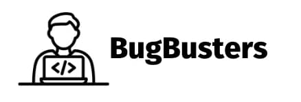

# ProDesk - Mobile

Este é o repositório da aplicação mobile **ProDesk**, um projeto desenvolvido pela equipe Bug Busters para o **5º semestre de Análise e Desenvolvimento de Sistemas** da Fatec São José dos Campos.

O ProDesk é um sistema de **Help Desk para serviços de TI**, que permite que usuários registrem e acompanhem chamados de suporte técnico de forma simples e organizada.

Acesse o repositório principal do projeto aqui ->  
<a href="https://github.com/Bug-Busters-F/ProDesk">ProDesk</a>

Instruções para rodar o projeto acesse  
<a href="./CONTRIBUTING.md">CONTRIBUTING.MD</a>

A aplicação mobile é responsável por:

- Permitir que usuários abram chamados de suporte.
- Facilitar a comunicação com a equipe de TI.
- Consumir a API do backend do sistema.

O objetivo é oferecer uma interface simples e prática para que usuários possam solicitar suporte técnico diretamente pelo celular.

| Cliente | Periodo/Curso                                  | Professor M2     | Professor P2     | Contato Cliente              |
| ------- | ---------------------------------------------- | ---------------- | ---------------- | ---------------------------- |
| Pro4tech | 5º ADS (Análise e Desenvolvimento de Sistemas)| Ronaldo Emerick  | Gerson Penha     | <rafael.monteiro@pro4tech.com.br>   <larissa.souza@pro4tech.com.br> |

</img>